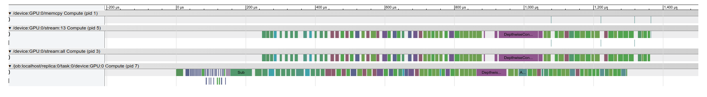
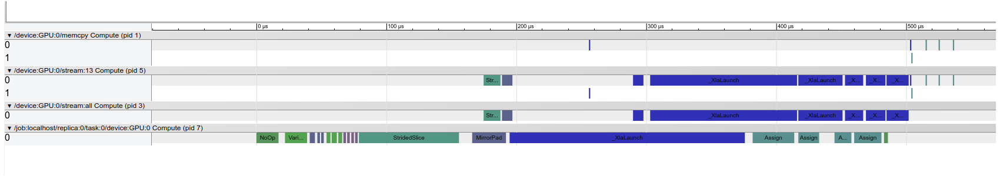

# Background

[Tensorflow](https://www.tensorflow.org) is a machine-learning framework
developed by Google and initially released publicly in 2015. Based on its
website, "TensorFlow is a tool for machine learning. While it contains a wide
range of functionality, TensorFlow is mainly designed for deep neural network
models." Here, our goal is to test the suitability of Tensorflow for solving
coupled systems of ordinary differential equations (ODE) that arise in the
numerical modeling of cardiac electrophysiology systems.

TensorFlow is primarily, but not exclusively, a machine learning framework.
However, TensorFlow graphs are powerful models that can be useful in variety of
non-machine learning applications.

TensorFlow applications generally have two main stages. In the first stage,
a TensorFlow graph is defined. A TensorFlow graph is a directed acyclic graph
(with some exceptions to the acyclicity), where nodes correspond to tensors
(multi-dimensional arrays) or operations on tensors, and links denote data
movement among the nodes.

The main power of TensorFlow is the ability to run the model graphs on
heterogeneous hardwares, including CPU, GPU, or even Google developed Tensor
Processing Units (TPU).

# Introduction to **fib_tf**

**fib_tf** is a python framework developed on the top of TensorFlow for 2D
cardiac electrophysiology simulation using explicit Euler method.

**fib_tf** is designed to run on GPU. Explicit Cardiac electrophysiology models
are particuarly suitable for running on GPU, as the main dependency between ODEs
is through Laplacian, which is only a small fraction of the total computational
cost.

Our goal is to optimize the **fib_tf** code to make its
running time close to a hand-optimized CUDA C++ code running the same model.

In this document, we first describe a straight forward translation of cardiac
models into TensorFlow. We then explains various optimizing tricks needed to
make **fib_tf** performance acceptable (of course, it is
still far from hand-optimized codes).

# *4v* Cardiac Model

Let's start by writing a simple 2D solver for the Cherry-Ehrlich-Nattel-Fenton 4-variable atrial model (*4v* from here on). With only four variables, this
model provides a good entry point for simulation.

The basis of most cardiac electrophysiology simulations is the standard mono-domain reaction-diffusion equation,

\[
  \partial V / \partial t = \nabla (D  \nabla V) - \frac {I_{ion}} {C_m},
\]

where the scalar field $V$ is the transmembrane potential, $D$ is the diffusion tensor, $I_{ion}$ is the sum of all ionic currents, and $C_m$ is the membrane capacitance ($C_m$ is usually set to 1 μF/cm).

For the sake of simplicity, we assume a uniform isotropic medium. Therefore, tensor $D$ is reduced to a scalar $g$, denoting global diffusion coefficient. We
have

\[
  \partial V / \partial t = g\,\nabla^2{V} - \frac {I_{ion}} {C_m}.
 \]

The *4v* model has four state variables: $u$, $v$, $w$, and $s$, where $u$ represents the transmembrane voltage; the other three are gating variables with different time constants. All four variables range from 0 to 1.
The initial condition is $(u, v, w, s) = (0, 1, 1, 0)$.

Using the Euler explicit integration, we have

\[
    v(t+\Delta{t}) = v(t) + \Delta{t}\,dv/dt,
\]

where we have made the dependence on $t$ explicit. Similarly,

\[
    w(t+\Delta{t}) = w(t) + \Delta{t}\,dw/dt,
\]

and,

\[
    s(t+\Delta{t}) = s(t) + \Delta{t}\,ds/dt.
\]

The time integration formula for $u$ has an additional term related to the
Laplacian:

\[
    u(t+\Delta{t}) = u(t) + \Delta{t}\,du/dt + g\,\Delta{t}\,\nabla^2{u}.
\]

We need to calculate the time derivatives of the state variables at each time
point. First, we update the dynamic time constants,

\[
  \tau_v^n =
  \begin{cases}
    \tau_{v2}^n & \quad \text{if } u \geq u_v \\
    \tau_{v1}^n & \quad \text{if } u < u_v
  \end{cases},
\]

and,

\[
  r_s =
  \begin{cases}
    r_s^p & \quad \text{if } u \geq u_c \\
    r_s^n & \quad \text{if } u < u_c
  \end{cases}.
\]

Next, the instantaneous currents are calculated:

\[
  I_{fi} =
  \begin{cases}
    -v(u-u_c)(1-u) / \tau_d & \quad \text{if } u \geq u_c \\
    0 & \quad \text{if } u < u_v
  \end{cases},
\]

\[
  I_{si} = -ws / \tau_{si},
\]

\[
  I_{so} =
  \begin{cases}
    \tau_a & \quad \text{if } u \geq u_{so} \\
    u/\tau_0 & \quad \text{if } u < u_{so}
  \end{cases}
\]

and,

\[
  I_{so} = I_{so}' + 0.5 (a_{so} - \tau_a) (1 + \tanh((u-b_{so})/c_{so}) ).
\]

Finally, we obtain the time derivative of the state variables

\[
  du/dt = -(I_{fi} + I_{si} + I_{so}),
\]

\[
  dv/dt =
  \begin{cases}
    (1-v) / \tau_v^p & \quad \text{if } u < u_c \\
    -v / \tau_v^n & \quad \text{if } u \geq u_c
  \end{cases},
\]

\[
  dw/dt =
  \begin{cases}
    (1-w) / \tau_w^p & \quad \text{if } u < u_c \\
    -w / \tau_w^n & \quad \text{if } u \geq u_c
  \end{cases},
\]

and,

\[
  ds/dt = r_s (0.5 (1 + \tanh(k(u-u_{c,si}))) -s).
\]

# A Simple 4v Solver

The TensorFlow website has an [example](https://www.tensorflow.org/tutorials/pdes) of solving a simple partial differential equation. This example served as the starting point of the current project; albeit, in the end, only a tiny fraction of its code remained in the final model!

In this section, we present a straight forward translation of the 4v model into
TensorFlow code by modifying the example mentioned above. You can find it as **fenton_simple.py**. As we will see, the resulting code is not very efficient. Various modifications done to make it as fast as possible are discussed in the following sections.

In a typical TensorFlow applications, we first define a TensorFlow graph. A TensorFlow graph is a directed acyclic graph, where nodes correspond to tensors (general multi-dimensional arrays) or operations on tensors, and links denote data movement among the nodes. Such a graph can then be executed once or multiple times.

**fenton_simple.py** begins with few utility functions. **laplace** and its helper functions (**make_kernel** and **simple_conv**) are copied verbatim from the website example. **enforce_boundary** ensures a no-flux (Neumann) boundary condition.

The TensorFlow example also defines a utility function **DisplayArray** to visualize the results of simulation. This function only works in a Jupyter notebook environment. I prefer a more general visualization routine that also works from ipython and command line. Therefore, instead of **DisplayArray**, we import **Screen** from **screen.py** that uses an SDL2 window.

The bulk of the code is contained in class **Fenton4vSimple**. The model graph is defined in **Fenton4vSimple.define**, where we introduce four numpy arrays to represent the shape and initial values of the four state variables:

```python
u_init = np.full([self.height, self.width], self.min_v, dtype=np.float32)
v_init = np.full([self.height, self.width], 1.0, dtype=np.float32)
w_init = np.full([self.height, self.width], 1.0, dtype=np.float32)
s_init = np.full([self.height, self.width], 0.0, dtype=np.float32)
```

Then, we define four corresponding tensorflow variables and link them to the
numpy arrays:

```python
U  = tf.Variable(u_init, name='U')
V  = tf.Variable(v_init, name='V')
W  = tf.Variable(w_init, name='W')
S  = tf.Variable(s_init, name='S')
```

The TensorFlow graph to calculate the new values of the state variables after one time step of the explicit Euler method is generated by calling **Fenton4vSimple.solve** (which in turns calls **Fenton4vSimple.differentiate**) from  **Fenton4vSimple.define** as:

```python
state = [U, V, W, S]
U1, V1, W1, S1 = self.solve(state)
```

Finally, we need to copy back the new values of the state variables. As mentioned above, TensorFlow graphs are generally acyclic. One exception to this rule is **tf.assign** operation that allows such copy backs. We have:

```python
self._ode_op = tf.group(
    U.assign(U1),
    V.assign(V1),
    W.assign(W1),
    S.assign(S1)
    )
```

In order to run a graph, it should be connected to a **tf.Session** that provides a context for execution. This is done in **Fenton4vSimple.run**, which after creating a session and initializes the graph, runs the graph for the desired number of steps and send the transmembrane voltage array to **Screen** every 1 ms for visualization.

We can run the model as

```
python3 fenton_simple.py
```

On my desktop computer (1.7 GHz quad-code running Ubuntu 14.04 with an NVidia GTX-1080 GPU), **fenton_simple.py** takes ~12.5 sec to run one second of simulation over a 512 x 512 medium. This is actually not good! A hand optimized CUDA code runs the same thing in less than a second. In the following sections, we describe optimization tricks that improve the timing by a factor of 3-4.

# The Root Cause of Slowness

Before describing the solutions, let's first see if we can find the root cause of the sub-optimal performance of the simple model.

TensorFlow has a powerful [profiler](https://github.com/tensorflow/tensorflow/blob/master/tensorflow/core/profiler/README.md). We profile one time step in **Fenton4vSimple.run** and save the results as *timeline_simple.json*, which can be visualized in chrome browser by typing *chrome://trace* in the address bar and load the file. The result is



Based on the horizontal time bar on the top of the figure, one time step takes a little over $1,200\,\mu\text{s}$. Since we use a $\Delta{t} = 0.1\,\text{ms}$, one second of simulation requires 10000 iterations or ~12 sec.

The main point of the profile is the presence of numerous CUDA kernel launches (each green or purple block signifies a kernel launch). In the baseline TensorFlow, kernels correspond to basic operations like *Add*, *Sub*, *Mul*, and *Conv*. Each kernel launch imposes a timing overhead (the white gaps between the blocks). Even worse is the fact that each kernel needs to read its inputs from and write its outputs to the global GPU memory. Considering that the global memory is the primary bottleneck of the GPU applications, all these reading and writing intermediate results severely degrades the performance.

Fortunately, the TensorFlow developers have recognized this problem and have devise a solution, which is discussed in the next section.

# Just-In-Time (JIT) Compilation

TensorFlow has the very exciting capability of using [JIT compilation](https://www.tensorflow.org/performance/xla/jit) to combine multiple atomic CUDA kernels into one large kernel. JIT compilation mitigates the performance penalty of having many smaller kernels. However, it is still not available in the stock versions of Tensorflow (at least not in version 1.7). To enable it, you need to [compile](https://www.tensorflow.org/install/install_sources) Tensorflow from source.

**fenton_jit.py** is a modifed version of **fenton_simple.py**. The main change is in **fenton_simple.solve** function, where the Euler integration steps are moved inside a *jit_scope*.

```python
scope = tf.contrib.compiler.jit.experimental_jit_scope()

with scope:
    dU, dV, dW, dS = self.differentiate(U, V, W, S)
    U1 = U0 + self.dt * dU + self.diff * self.dt * laplace(U0)
    V1 = V + self.dt * dV
    W1 = W + self.dt * dW
    S1 = S + self.dt * dS
```

Just with this change, the model runs more than twice faster (<6 sec per second of simulation). Now, the profile becomes



One time step takes a little over $500\,\mu\text{s}$. Also note there are only few blocks. The blue block is the fused kernel generated by the JIT compiler and it contains most of the logic of the program.

# Other Optimization Tricks

JIT compilation is the main, but not the sole, optimization trick to improve the performance. In this section, we describe few other improvements that together raise the performance by another factor of 1.5-2.
